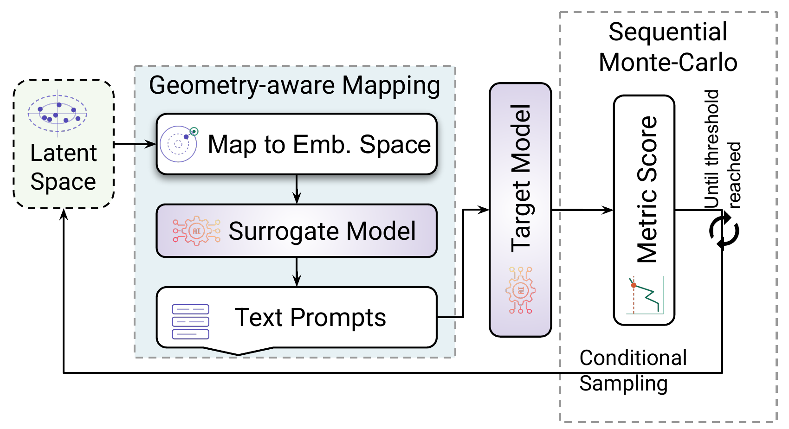
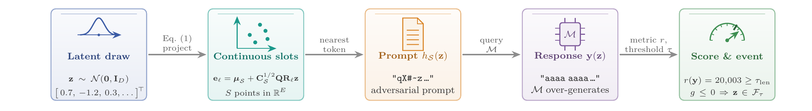
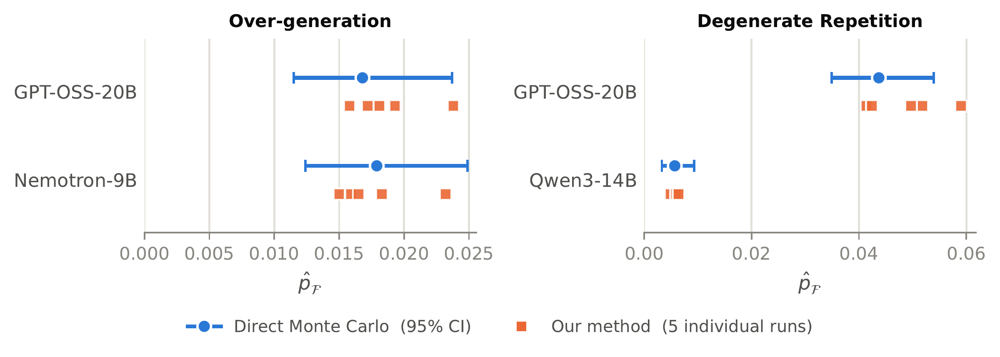

# RareTrap

**Tail Risk Estimation for Language Models via Latent Prompt Modeling**

Code for estimating extreme output-length and repetition probabilities using
geometry-aware prompt modeling and Subset Simulation.

[Setup](docs/setup.md) · [Experiments & ablation](docs/experiments.md) ·
[Outputs & analysis](docs/outputs.md)



*Geometry-aware prompt construction and conditional sampling toward the target event.*

## From latent samples to responses



*Illustrative pipeline from the paper; the example response and score are schematic.*

## Comparison with direct Monte Carlo



*Target-event probability estimates at matched evaluation counts. Blue: direct
Monte Carlo with 95% confidence intervals. Orange: five individual RareTrap runs.*

## Getting started

Follow [Setup](docs/setup.md) and the optional
[offline verification](docs/setup.md#verify-without-model-downloads).
The [paper-to-code reference](docs/experiments.md#paper-to-code-reference)
locates the method components. Inspect a paper configuration:

```bash
raretrap run --preset validation.qwen3-14b.qwen3-0.6b.repetition.seed1010 \
  --output outputs/qwen-validation --dry-run
```

Remove `--dry-run` to execute. Full experiments require CUDA and can be expensive.

[Contributing](CONTRIBUTING.md) · [Security](SECURITY.md)

See the [reproduction scope](docs/experiments.md#paper-configurations) for recorded
configurations versus fixed-map reruns. Model weights and raw experiment artifacts
are not included; the figures above are from the paper.
Licensing is pending.
